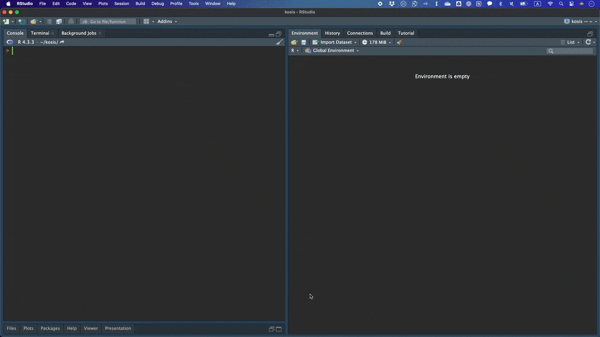

# KOSIS 패키지를 활용한 R 패키지 개발 가이드

## 1. 서론

KOSIS(Korean Statistical Information Service, 국가통계포털)는 대한민국 정부의 공식 통계 데이터를 제공하는 포털입니다. `KOSIS` 패키지는 이 데이터를 R 환경에서 직접 가져와 분석할 수 있도록 돕는 API 도구입니다. 여기서는 `usethis`와 `devtools` 패키지를 활용하여 `KOSIS` 패키지의 대략적인 개발 방법을 소개합니다.

## 2. 패키지 개발 준비

### 2.1 필수 패키지 설치

먼저, R 패키지 개발에 필요한 패키지들을 설치합니다.

``` r
# 필수 패키지 설치
install.packages(c("devtools", "usethis"))
```

-   `devtools`: R 패키지 개발과 테스트, 배포를 간편하게 할 수 있도록 돕습니다.
-   `usethis`: R 패키지 개발을 위한 다양한 편의 기능을 제공합니다.

### 2.2 패키지 초기화

패키지를 처음부터 개발하기 위해 `usethis::create_package()` 함수를 사용해 패키지를 초기화합니다.

``` r
# 패키지 생성
usethis::create_package("path/to/your/kosis")
```

{: width="70%"}

이 명령어는 패키지의 기본 구조를 자동으로 생성합니다. `DESCRIPTION`, `NAMESPACE`, `R/` 등의 기본 파일과 디렉토리가 설정됩니다. 잘 아시다시피 사실 이 과정은 RStudio에서 새로운 프로젝트를 생성하는 것으로 대체할 수 있습니다. 최종적으로는 다음과 같은 구조를 갖습니다.

{: width="70%"}

## 3. 패키지 메타데이터 설정

### 3.1 DESCRIPTION 파일 수정

패키지의 메타데이터는 `DESCRIPTION` 파일에 저장됩니다. 이 파일을 수정하여 패키지의 정보를 설정합니다. `usethis::use_description()` 함수를 사용해 필요한 메타데이터를 추가합니다.

``` r
# description
usethis::use_description()

# or with details
usethis::use_description(fields = list(
  Title = "Korean Statistical Information Service (KOSIS)",
  `Authors@R` = 'person(given = "Seokhoon", family = "Joo", email = "seokhoonj@gmail.com", role = c("aut", "cre"))',
  Description = "API wrapper to download statistical information from the Korean Statistical Information Service (KOSIS) <https://kosis.kr/openapi/index/index.jsp>."
))

# license
usethis::use_mit_license()
```

{: width="70%"}

그 밖에 필요한 패키지를 import하는 코드를 DESCRIPTION 파일에 직접 작성해 넣도록 합니다. Package Version을 괄호안에 추가하는 것이 필수는 아니지만 추후 문제 해결의 용이성을 위해 버전을 기록해 두는 것이 좋습니다. `packageVersion("data.table")` 코드로 현재 버전을 확인할 수 있습니다.

``` r
Imports: 
    data.table (>= 1.13.0),
    httr (>= 1.4.3),
    jsonlite (>= 1.7.2),
    tibble (>= 3.2.1)
```

참고로, 배포된 패키지만 활용해서 패키지를 개발할 수 있는 것은 아닙니다. KOSIS 패키지를 개발하는 데 필요하진 않지만 다음 코드를 활용하면 배포되지 않은 패키지도 활용할 수 있습니다.

``` r
Remotes:
    github::seokhoonj/jaid,
    github::seokhoonj/ggshort
```

### 3.2 NAMESPACE 파일 수정

NAMESPACE는 `usethis::use_namespace()`를 통해 자동 관리될 수 있습니다.

``` r
use_namespace()
```

{: width="70%"}

일반적으로 함수 정의 파일 상단에 Roxygen2 주석을 달고, `@export` 태그를 사용하면 `devtools::document()`를 통해 `NAMESPACE` 파일이 자동으로 갱신됩니다.

``` r
#' Set KOSIS API Key
#'
#' Save KOSIS API key for the current session.
#'
#' @export
kosis.printKey <- function(x) {
  Sys.getenv("KOSIS_API_KEY") # KOSIS_API_KEY라고 저장된 환경변수를 불러옴
}
```

다른 패키지에서 함수를 Import하는 경우, `usethis::use_package_doc()`함수를 활용하여 패키지 수준의 문서 파일을 생성한 후 직접 입력할 수도 있고,

``` r
usethis::use_package_doc()
```

{: width="70%"}

`usethis::use_import_from("data.table", "is.data.table")`으로 함수를 불러오는 경우도 있습니다.

``` r
usethis::use_import_from("data.table", "is.data.table")
```

{: width="70%"}

이제 `NAMESPACE`는 `devtools::document()`를 통해 업데이트 관리가 가능해집니다. 이는 패키지 개발 과정에서 실수를 줄이고, 더 효율적으로 작업할 수 있게 해줍니다. 이러한 자동화된 방법을 사용하면 패키지의 일관성을 유지하면서 개발 속도를 높일 수 있습니다.

``` r
devtools::document()
```

{: width="70%"}

`kosis.printKey()` 함수가 `export(kosis.printKey)`로 확인되고 `is.data.table` 함수가 `importFrom(data.table,is.data.table)` 로 확인됩니다.

## 4. KOSIS API 연동 및 함수 개발

### 4.1 API 키 설정 및 API KEY 관련 함수 작성

KOSIS API를 사용하려면 API 키가 필요합니다. 이를 환경 변수에 저장하여 패키지 내부에서 사용할 수 있도록 합니다. 영구 환경 변수로 적용하려면 `usethis::edit_r_environ()`로 직접 API KEY를 입력합니다.

``` r
usethis::edit_r_environ()
```

{: width="70%"}

다음으로 KOSIS API를 적용하는 함수를 작성합니다. 저는 R코드 작성시 주로 `Snake Case`를 적용합니다만, 해당 홈페이지에서 `Camel Case`를 쓰고 있었으므로 일관성 유지를 위해 `Camel Case`를 적용하였습니다. `kosis.getKey`와 `kosis.printKey`는 본질적으로 같은 함수입니다만, `kosis.getKey`는 외부로 export되지 않습니다. 따라서 `kosis::kosis.getKey` 와 같이 더블 콜론으로는 검색이 불가능합니다. (`kosis:::kosis.getKey` 처럼 트리플 콜론을 이용해 확인가능합니다.)

``` r
# API 키 설정 함수
kosis.setKey <- function(apiKey) {
  Sys.setenv(KOSIS_API_KEY = api_key)
}

# API 키 불러오기 함수
kosis.getKey <- function() {
    apiKey <- Sys.getenv("KOSIS_API_KEY")
    if (apiKey == "") {
        stop("Please run this code to provide your KOSIS API Key: kosis.setKey('your_api_key').", 
             call. = FALSE)
    }
    return(apiKey)
}

# API 키 출력 함수
kosis.printKey <- function() {
  Sys.getenv("KOSIS_API_KEY")
}
```

### 4.2 KOSIS 데이터 요청 함수 작성

이제 KOSIS API를 사용하여 데이터를 가져오는 함수를 작성합니다. 이 함수는 사용자가 특정 통계 코드를 제공하면 해당 데이터를 가져옵니다. KOSIS 패키지에서 가장 중요한 함수는 이 두 함수라고 보면 됩니다. 여기서도 `setURL` 함수와 `setStatListColOrder` 함수는 외부로 export되는 함수가 아닙니다.

``` r
# KOSIS 데이터 목록 가져오기 함수
getStatList <- function(vwCd = c("MT_ZTITLE", "MT_OTITLE", "MT_GTITLE01", "MT_GTITLE02", "MT_CHOSUN_TITLE", "MT_HANKUK_TITLE", "MT_STOP_TITLE", "MT_RTITLE", "MT_BUKHAN", "MT_TM1_TITLE", "MT_TM2_TITLE", "MT_ETITLE"), parentListId = "") {
    apiKey <- kosis.getKey()
    vwCd <- match.arg(vwCd)
    param <- list(method = "getList", apiKey = apiKey, format = "json", 
        vwCd = vwCd, parentListId = parentListId, jsonVD = "Y")
    baseurl <- "https://kosis.kr/openapi/statisticsList.do"
    attr(param, "baseurl") <- baseurl
    url <- setURL(param)
    page <- httr::GET(url)
    data <- jsonlite::fromJSON(content(x = page, as = "text", 
        encoding = "UTF-8"))
    if (!is.null(data$err)) 
        return(data)
    statList <- setStatListColOrder(data)
    return(statList)
}

# KOSIS 데이터 가져오기 함수
getStatData <- function (orgId, tblId, prdSe = c("Y", "H", "Q", "M", "D", "IR"), startPrdDe, endPrdDe, newEstPrdCnt = 3, prdInterval = 1, itmId = "ALL", objL1 = "ALL", objL2 = "", objL3 = "", objL4 = "", ...) {
    apiKey <- kosis.getKey()
    prdSe <- match.arg(prdSe)
    if (missing(startPrdDe)) {
        param <- list(method = "getList", apiKey = apiKey, format = "json", 
            jsonVD = "Y", prdSe = prdSe, newEstPrdCnt = newEstPrdCnt, 
            prdInterval = prdInterval, orgId = orgId, tblId = tblId, 
            itmId = itmId, objL1 = objL1, objL2 = objL2, objL3 = objL3, 
            objL4 = objL4, ...)
    }
    else {
        param <- list(method = "getList", apiKey = apiKey, format = "json", 
            jsonVD = "Y", prdSe = prdSe, startPrdDe = startPrdDe, 
            endPrdDe = endPrdDe, orgId = orgId, tblId = tblId, 
            itmId = itmId, objL1 = objL1, objL2 = objL2, objL3 = objL3, 
            objL4 = objL4, ...)
    }
    baseurl <- "https://kosis.kr/openapi/Param/statisticsParameterData.do"
    attr(param, "baseurl") <- baseurl
    url <- setURL(param)
    page <- httr::GET(url)
    content <- httr::content(x = page, as = "text", encoding = "UTF-8")
    data <- jsonlite::fromJSON(content)
    if (!is.null(data$err)) 
        return(data)
    statData <- setStatDataColOrder(data)
    return(statData)
}
```

## 5. 패키지 문서화 및 테스트

### 5.1 Roxygen2을 통한 문서화

`Roxygen2`를 사용하여 함수의 문서를 자동으로 생성할 수 있습니다. 함수 코드 상단에 주석으로 문서화를 추가한 후, `usethis::use_roxygen_md()` 명령어를 사용하여 `.Rd` 파일을 생성합니다. 대부분의 사람들이 이 메뉴얼 작업을 싫어하고, 저도 그렇습니다. 배포가 목적이 아니라면 아주 간단하게 적어도 무방합니다. (~~아예 적지 않아도 됩니다~~...)

``` r
#' KOSIS Statistic Data
#'
#' @details
#' \preformatted{
#' ## Example
#' getStatData(orgId = "101", tblId = "DT_1B41")
#' }
#'
#' @param orgId A string specifying the organization id
#' @param tblId A string specifying the table id
#' @param prdSe A string specifying the period symbol (Y, H, Q, M, D, IR: Irregularly)
#' @param startPrdDe A string specifying start period
#' (format: YYYY, YYYYMM(MM:01~12), YYYYHH(HH:01,02), YYYYQQ(QQ:01~04), YYYYMMDD)
#' @param endPrdDe A string specifying end period
#' (format: YYYY, YYYYMM(MM:01~12), YYYYHH(HH:01,02), YYYYQQ(QQ:01~04), YYYYMMDD)
#' @param newEstPrdCnt A string specifying newest period count
#' @param prdInterval A string specifying period interval
#' @param itmId A string item id
#' @param objL1 A string specifying object level 1
#' @param objL2 A string specifying object level 2
#' @param objL3 A string specifying object level 3
#' @param objL4 A string specifying object level 4
#' @param ... A string specifying object level 5, 6, 7, 8 (objL5, objL6, objL7, objL8)
#' @return A data.frame object containing queried information
#' @export
getStatData <- function(orgId, tblId, prdSe = c("Y", "H", "Q", "M", "D", "IR"), startPrdDe, endPrdDe, newEstPrdCnt = 3, prdInterval = 1, itmId = "ALL", objL1 = "ALL", objL2 = "", objL3 = "", objL4 = "", ...) {
  ...
}
```

### 5.2 README.md, NEWS.md 파일 작성

<a href="https://github.com/seokhoonj/kosis/blob/main/README.md" target="_blank" rel="noopener noreferrer">README.md</a> 파일은 패키지의 주요 기능과 예제 코드를 제공하여 사용자들이 패키지의 활용 방식을 쉽게 이해하도록 합니다.

``` r
usethis::use_readme_md()
```

{: width="70%"}

NEWS.md 파일은 패키지에 대한 수정, 변경사항에 대한 설명을 위한 파일입니다. CRAN에 등록된 후 버전 변경시 꼭 작성하는 것이 좋습니다. 

``` r
usethis::use_news_md()
```

{: width="70%"}

### 5.3 테스트 작성

`testthat` 패키지를 사용하여 함수의 테스트를 작성합니다. 이를 통해 패키지의 안정성을 확보할 수 있습니다. 다만 `kosis` 패키지에서는 테스트 코드를 작성하지 않았습니다.

## 6. 패키지 체크 및 배포

### 6.1 패키지 체크 및 배포

`devtools::check` 함수를 사용하여 패키지를 체크하고, 테스트를 실행합니다. 이는 패키지를 CRAN에 제출하기 전에 확인해야 할 중요한 과정입니다.

``` r
devtools::check()
```

{: width="70%"}

### 6.2 cran-comments.md 작성

`devtools::check`를 통해 얻어진 결과를 cran-comments.md 파일에 적용합니다. 이는 패키지를 제출할 때 CRAN 리뷰어에게 패키지의 변경 사항, 테스트 결과, 환경 정보 등을 전달하는 데 사용됩니다

``` r
usethis::use_cran_comments()
```

{: width="70%"}

### 6.3 GitHub에 패키지 배포

패키지를 CRAN에 제출하기 전에 GitHub에 배포합니다. GitHub에 kosis라는 새로운 repository를 만들고 현재 프로젝트와 연결합니다. git에 대한 설명은 생략하도록 하겠습니다.

``` bash
git init
git remote add origin https://github.com/your-git-username/kosis.git
git add .
git commit -m 'first commits'
git push origin main
```

### 6.4 CRAN 제출

`devtools::release` 함수는 패키지를 검토하고, 필요한 정보를 수집한 다음, 최종적으로 CRAN에 자동으로 제출할 수 있도록 도와줍니다. 각 질문들을 보면 CRAN에 제출하기 전에 어떤 부분을 체크해야 하는지 알 수 있습니다. 제출하게 되면 자동검사가 시작됩니다.

``` r
devtools::release()
```

{: width="70%"}

### 6.5 CRAN 리뷰

자동검사가 끝난후 리뷰어가 배정되고 코드의 품질, 문서화의 완성도, 패키지의 안정성 등을 체크하게 됩니다. 리뷰 과정에서 피드백을 받아 패키지를 개선해야하며, 최종 승인이 되면 CRAN을 통해 전 세계 사용자에게 배포됩니다. (Thanks, on its way to CRAN. Best, Reviewer-name.)

## 7. 결론

이 가이드에서는 `KOSIS` 패키지를 통해 R 패키지를 개발하는 방법을 소개했습니다. 우리는 `usethis`와 `devtools`를 활용하여 패키지 개발 과정을 자동화하고, 효율적으로 관리할 수 있습니다. 패키지를 개발함으로써 코드의 재사용성을 높이고, 반복적인 작업을 자동화하여 생산성을 극대화할 수 있습니다. 

이 내용을 참조해서 R 패키지를 개발하는 경험을 쌓고, 실제 데이터 분석에서 사용할 수 있는 유용한 도구를 만들 수 있길 바라겠습니다.
